# Blockworld

Grow a garden, drive to the city, own apartment towers, and collect rent.
A free, open-source game for **macOS**, built with a custom **C++26** engine,
**SDL3**, and **Metal**.

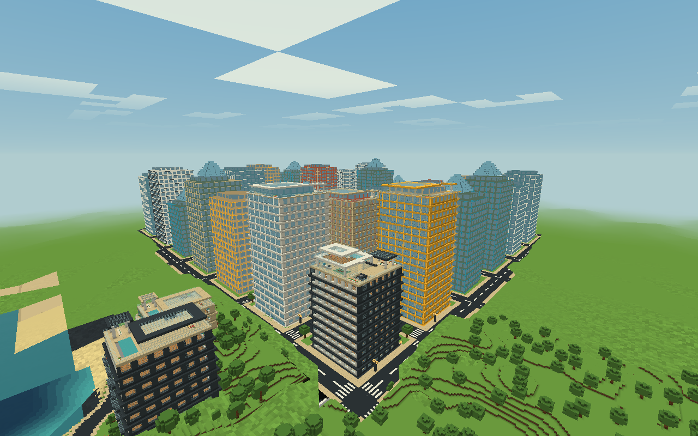

**Press L for your city:** bank, 20-car garage, residents, and owned properties.
**T** visits downtown; **U** visits the bank tower rooftop. Your farm, coast, and
castle are in the same world, linked by roads.

| Your bank account | Your car collection |
| :---: | :---: |
| 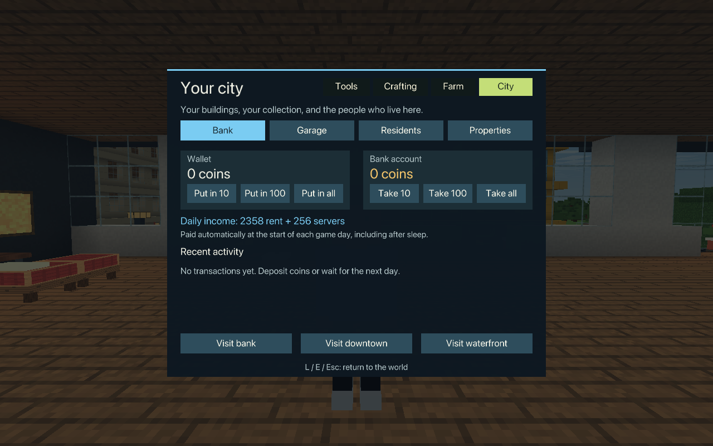 | 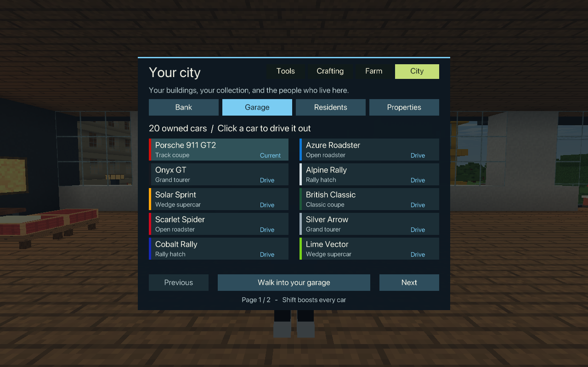 |

*Actual Metal captures from version 0.17.0.*

| People on the streets | A family at home |
| :---: | :---: |
| 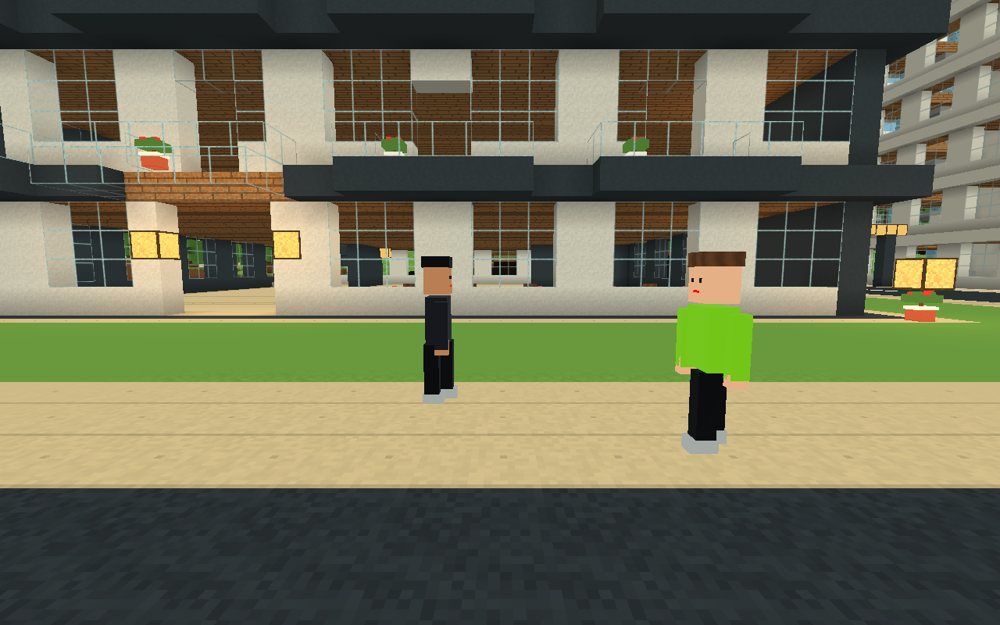 | 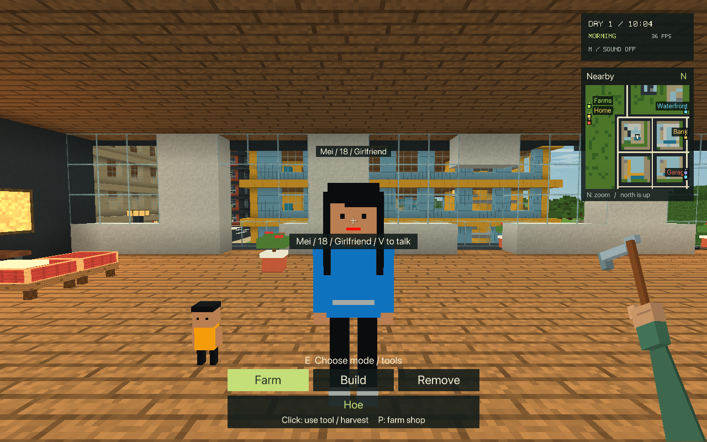 |

*Actual Metal captures: streets in 0.19.1 and the earlier family preview in 0.18.0, using temporary worlds.*

| Furnished apartment | Family care |
| :---: | :---: |
| 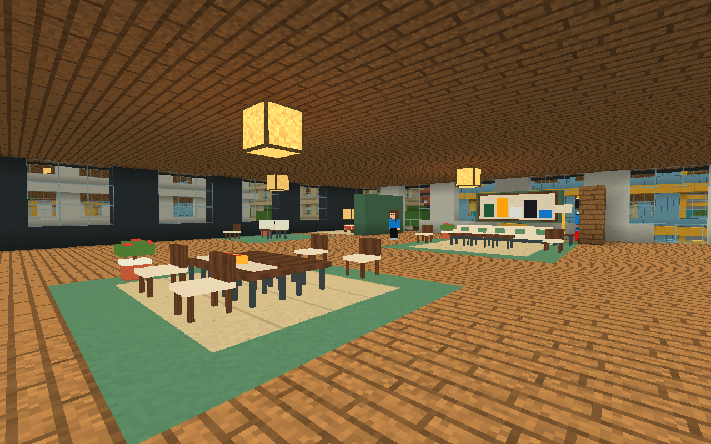 | 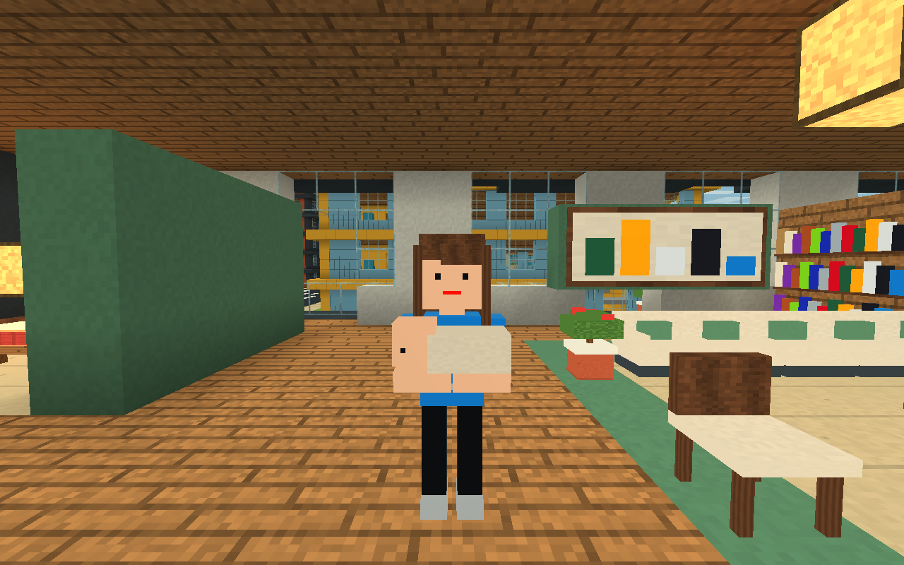 |

*Actual Metal captures from version 0.19.0, using temporary preview worlds.*

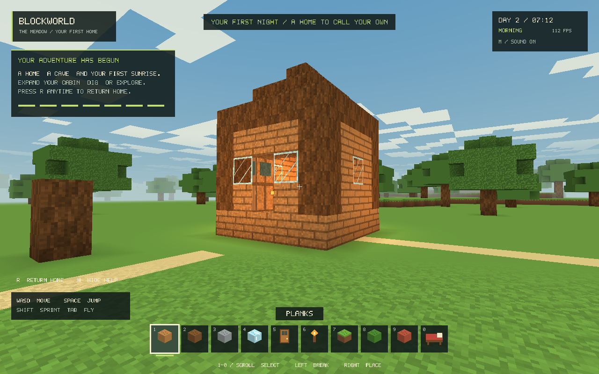

*Actual in-game screenshots from an earlier build. The current HUD and controls have changed.*

| Night at home | The lantern cave |
| :---: | :---: |
| 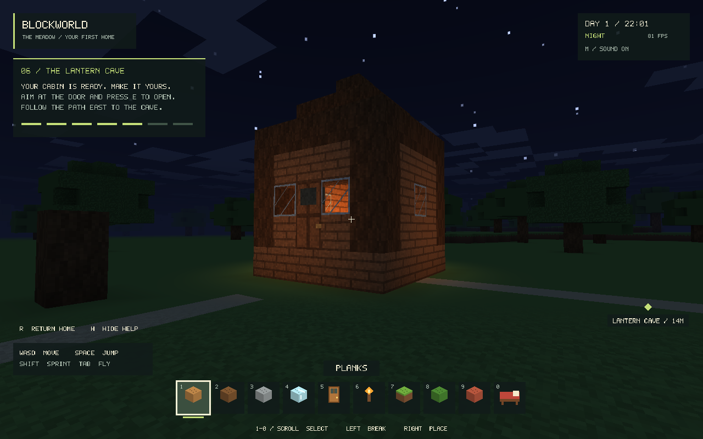 | 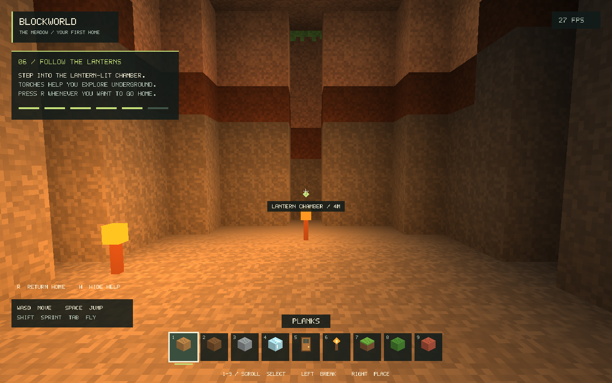 |

## What you can do

- **Grow food:** hoe the soil, plant carrots, wheat, strawberries, and pumpkins,
  then water and harvest them. Seeds and water are unlimited; crops never wilt.
- **Sell and upgrade:** trade produce and milk for coins, then buy compost,
  sprinklers, and a greenhouse.
- **Keep animals:** feed hens, hatch chicks, buy cows to milk, ride horses,
  and pet sheep and friendly foxes.
- **Build:** place and remove blocks, make a house, and furnish it with windows,
  doors, torches, and a bed. Building materials are unlimited.
- **Explore:** walk, fly, or drive your Porsche 911 GT2. Follow the path to the lantern
  cave, watch the sunset, and sleep until morning.
- **Drive to the city:** a marked two-lane road connects the farm outskirts to
  the coastal streets. The red GT2 has a rear wing, engine sounds, a chase camera,
  a speedometer, and an arcade top speed of about **150 km/h**. Hold **Shift** while
  accelerating for a **300 km/h boost**. Press **C** to bring it nearby.
- **Countryside farms:** turn off the highway at the **Farms** marker. Harvest
  four large fields of wheat, carrots, strawberries, and pumpkins; explore two
  barns, a glass nursery, a grain silo, and pastures with cows, a horse, and a sheep.
- **Find your way:** the minimap shows your heading, roads, home, city, farms,
  castle, and parked car. Press **N** to switch between nearby terrain and the route overview.
- **Your castle:** press **K** to visit a four-tower stone castle. Walk up the
  courtyard staircase and along the walls to the tower roof, or furnish the hall.
- **Own downtown:** 36 new towers with furnished apartments and offices,
  stairs to every floor, balconies, and rooftop terraces. Building rent and two
  data centers pay **2,614 coins per game day** into your bank account.
- **Bank:** **L → Bank** lets you deposit farm earnings and withdraw spending money.
- **Garage:** **L → Garage** holds 20 drivable cars across six body styles.
  Click a car to drive out, or walk among the collection. **C** brings your selected car.
- **City life:** 84 neighbors walk downtown sidewalks. Meet eight adult women
  in their apartments, chat, and optionally date them. Relationships persist independently.
- **Start a family:** while visiting your girlfriend, choose **Start a family**.
  A baby arrives in her apartment two game days later. Households can have up to
  three children; pregnancy and children are saved. This is a simple, non-explicit
  family simulation.
- **Make a home:** each resident's apartment has a coordinated kitchen, dining
  area, lounge, bookshelves, artwork, bedroom, plants, and a crib. Visit your family
  and choose **Feed baby** to see the mother cradle the baby; older children have
  **Feed children**. Feeding status is saved.
- **Coastal city:** **L → Bank → Visit waterfront** visits ten buildings along curved coves and beaches.
  Walk from the street to the rooftops, explore furnished apartments, and visit
  the fourteen-floor tower. The main penthouse terrace has
  a pool, pergola, skylights, a living room, and an upstairs bedroom.
- **Explore the bay:** press **J** for the northern shore. Follow the coastal road
  around the island, lagoon, and wooded hills, or bring your car with **C**.
- **Original city:** **Shift+T** returns to the earlier district. Your buildings
  and changes there remain saved.

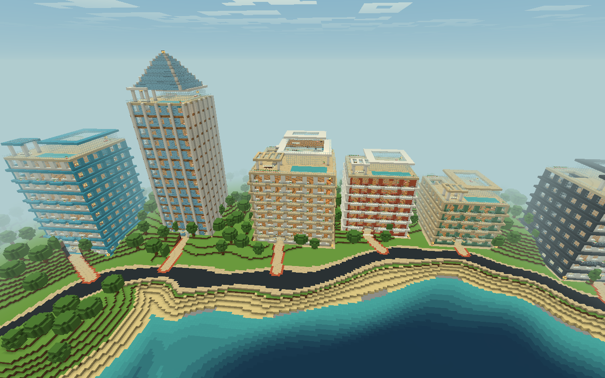

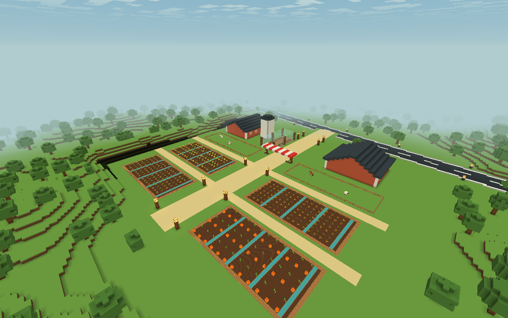

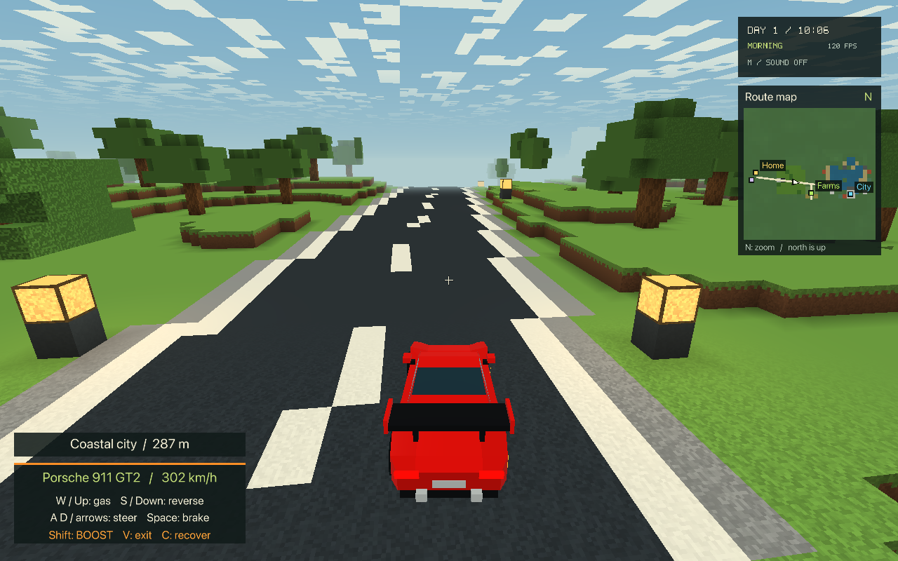

*Actual Metal framebuffer captures from version 0.16.0.*

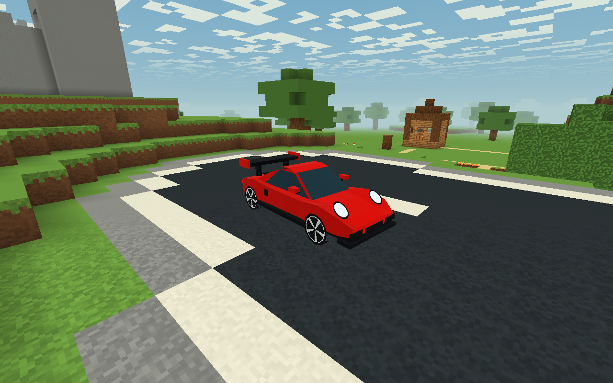

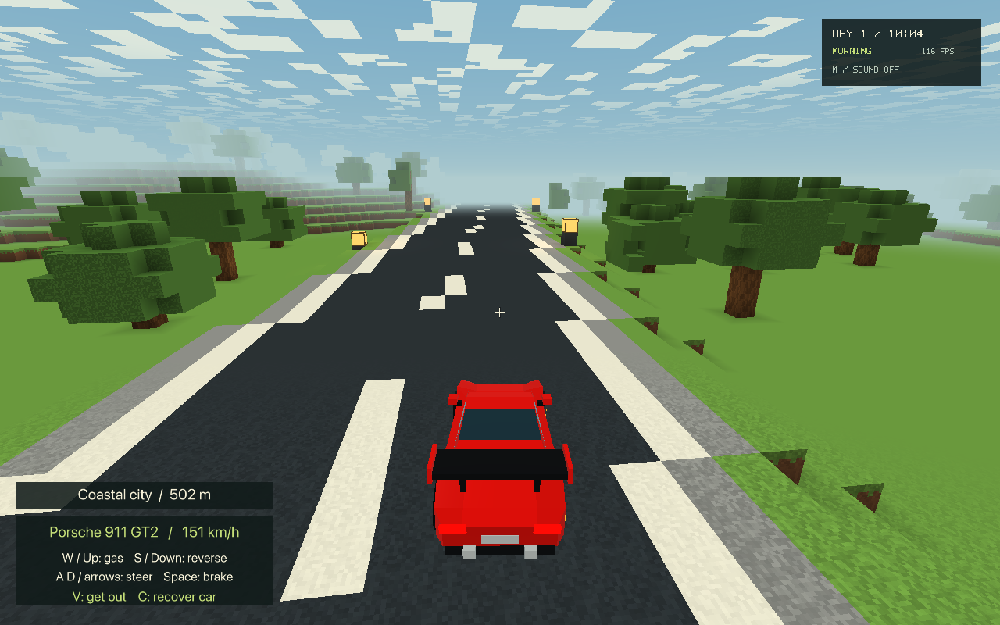

*Actual Metal framebuffer capture from version 0.15.0. The car is a stylized model
built for this block world.*

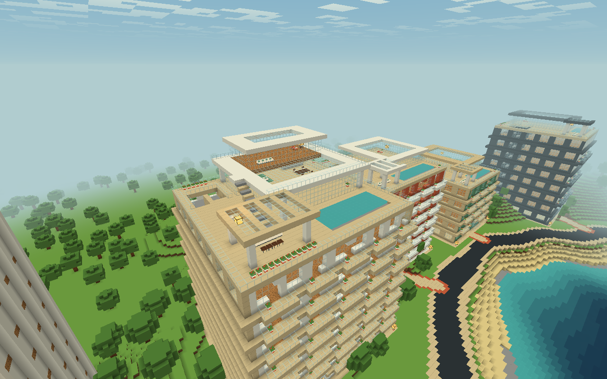

*Actual Metal framebuffer captures from version 0.14.0.*

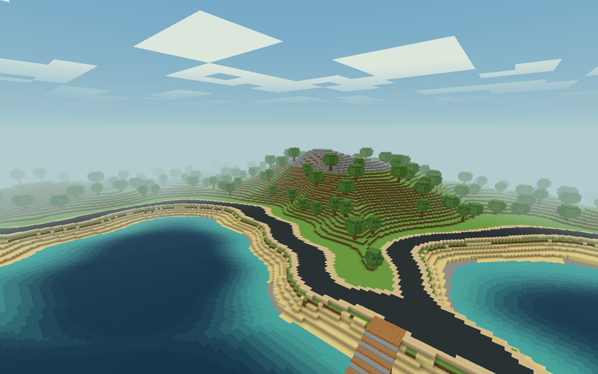

*Actual Metal framebuffer capture of the coastal terrain in version 0.13.0.*

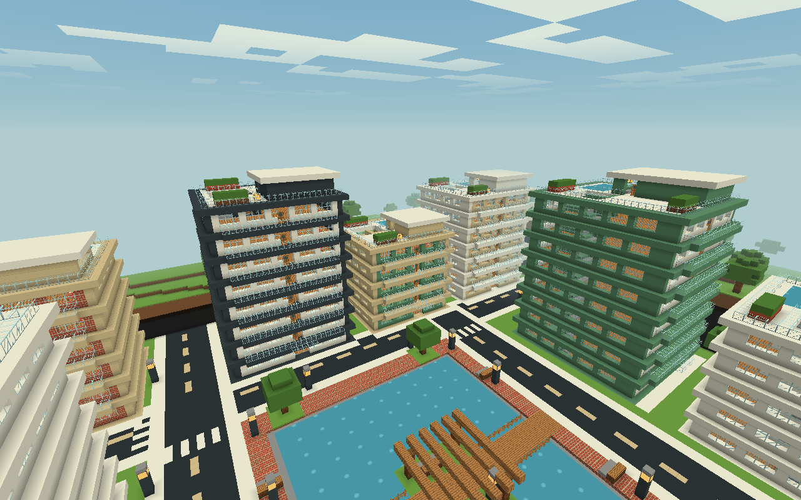

*Actual Metal framebuffer capture from version 0.12.0. The city takes visual inspiration
from [Mike Tomlin's rooftop and penthouse tour](https://www.youtube.com/watch?v=_h_pQ1-5iQg);
its layout and buildings are generated by Blockworld.*

This is a playable prototype, developed on an Apple Silicon Mac. It currently
supports macOS only, with no multiplayer or survival mode. Textures and sounds
are generated by the game; no Minecraft assets are included.

## Play on your Mac

Install [Homebrew](https://brew.sh/) and the Xcode command-line tools, then run:

```sh
brew install cmake ninja sdl3 glm llvm
git clone https://github.com/beejmaxx/blockworld.git
cd blockworld
export PATH="$(brew --prefix llvm)/bin:$PATH"
CC=clang CXX=clang++ ./run.command
```

The first launch builds the game. After that, open **`build/blockworld.app`** in
Finder to play. A C++26-capable compiler is required; Homebrew LLVM 20.1.5 and
Apple Clang 21 have been tested.

## Your first harvest

1. Click to enter the world. Move with **WASD or the arrow keys** and look with
   the mouse. **P → Garden → Visit garden** takes you to the vegetable beds.
2. Press **E → Farm → Hoe**. Aim at grass and click to prepare soil.
3. Choose **Carrot seeds** from the same picker, then click the soil to plant.
4. Choose **Watering can** and click the seedlings. When the carrots have
   orange roots, click them again to harvest.
5. Open **P → Shop → Sell basket**. Save **12 coins** for your first sprinkler.

Seeds are free, and plants keep growing without water. Menus pause the world.
See the [playing guide](docs/PLAYING.md) for crop prices, animals, upgrades, and building.

## Controls

**Press E, choose Farm, Build, or Remove, then click a labeled tool.**
The tool goes straight into your hand. Each mode remembers its own selection;
there are no slots to arrange. Your active mode stays visible at the bottom.

- **Farm:** click to use the hoe, plant seeds, water, harvest, or tend animals.
- **Build:** left-click places your selected block; right-click removes a block instantly.
- **Remove:** hold the visible hammer and click to remove a block instantly.

**V** places or interacts in every mode. In Build, press **E** to choose another material.
The numbered bar in Build lets you select materials directly with **1–9**; no menu or slot setup needed.
Choose **E → Build → More** for facade glass, colored tiles, sofas, tables, chairs, and flower planters.

| Action | Input |
| --- | --- |
| Move / look | WASD or arrow keys / mouse |
| Jump / sprint / sneak | Space / Ctrl / Shift |
| Farm: use tool. Build: place. Remove: remove block | Left-click; hold to repeat |
| Remove a block in Build mode | Right-click; hold to repeat |
| Choose mode and tools / optional crafting | E |
| Quick mode shortcuts | F: Farm, B: Build, X: Remove |
| Change tool within the current mode | Scroll; 1–9 are optional shortcuts |
| Place or interact with doors, beds, or animals | V |
| Farm, shop, and animals | P |
| Toggle flying | Tab or double-tap Space |
| Fly up / down | Space / Shift |
| Return home | R |
| Bring your free car nearby / visit the castle | C / K |
| Start beside the GT2 on the road to the city | Shift+C |
| Boost while driving / change minimap zoom | Shift / N |
| Downtown street / bank tower rooftop | T / U |
| Bank, garage, residents, and owned buildings | L |
| Northern coast / original city | J / Shift+T |
| Pause and release the mouse | Esc |
| Mute / unmute | M |

Press **C** outside to bring your selected car nearby (the GT2 initially). Aim at it and press **V** to enter.
Hold **W / Up** to accelerate, use **A-D / Left-Right** to steer, and **Space** to brake.
Hold **Shift** with the accelerator for boost; release Shift to slow back to normal speed.
**S / Down** brakes and then reverses; **V** gets you out.
[All controls →](docs/PLAYING.md#controls)

## Your world

The game saves automatically every 30 seconds of play and when you quit.
Press **F5** to save immediately. Your world is stored at:

```text
~/Library/Application Support/Bijan/Blockworld/meadow.bw
```

For a separate world, run `./run.command --world-dir /path/to/another-world`.
Use `--no-save` for a temporary session. [More about saves →](docs/PLAYING.md#saved-worlds)

## Build and contribute

After the first build, run the tests with:

```sh
ctest --preset dev
```

See the [development guide](docs/DEVELOPMENT.md) for manual builds, the engine
layout, and rendering checks, or [CONTRIBUTING.md](CONTRIBUTING.md) to contribute.
[Bug reports](https://github.com/beejmaxx/blockworld/issues) are welcome.

## License

[MIT](LICENSE). SDL3 and GLM retain their own licenses.
