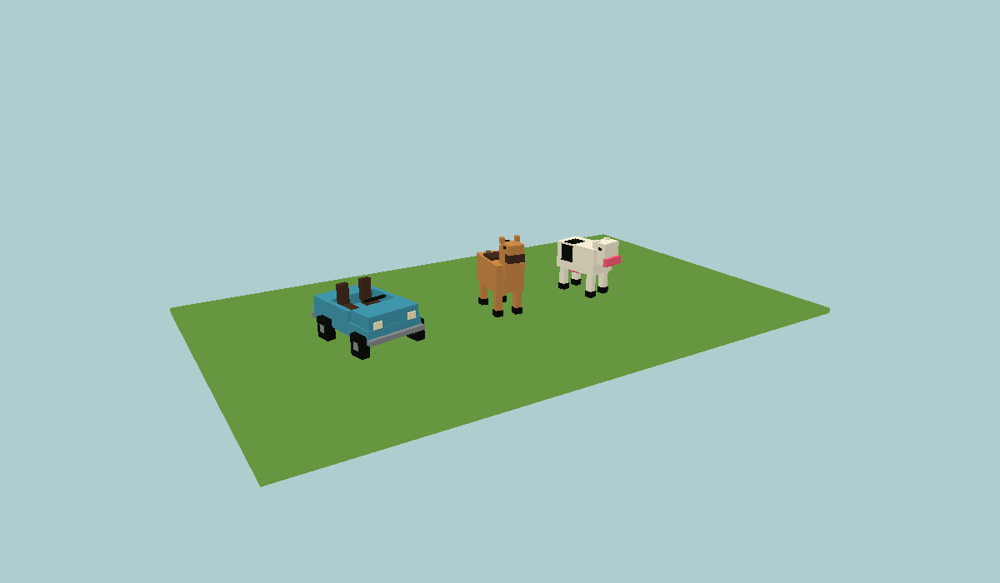
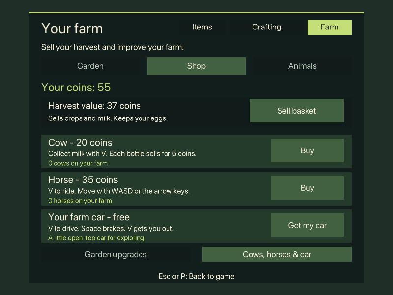

# Blockworld

A small vegetable-growing game in a Minecraft-style creative world, with a custom
**C++26** engine, SDL3, and Metal. Developed and tested on an Apple Silicon Mac. Textures and
the soundscape are generated by the game; Crafting, Inventory, and Garden/Shop menus use the macOS system font
through a cached texture atlas. No Minecraft assets are included.

**Free and open source under the [MIT license](LICENSE).** Currently supports
macOS; Windows and Linux ports are future work. This is a playable prototype.

Grow crops, sell produce and milk, buy cows and horses, build a home, or explore
in your farm car. Seeds and building materials are unlimited.



*Animal and vehicle models, shown in a CPU geometry preview.*



*Shop layout preview generated from the game's UI.*

## Quick start

Install [Homebrew](https://brew.sh/) and the Xcode command-line tools, then:

```sh
brew install cmake ninja sdl3 glm llvm
git clone https://github.com/beejmaxx/blockworld.git
cd blockworld
export PATH="$(brew --prefix llvm)/bin:$PATH"
CC=clang CXX=clang++ ./run.command
```

Homebrew LLVM provides a compiler with C++26 mode (tested with LLVM 20.1.5).
Apple Clang 21 also works.
The first launch builds the game. See [Build and play](#build-and-play) for
manual build and test commands, and [Controls](#controls) for keyboard shortcuts.

Bug reports and contributions are welcome; see [CONTRIBUTING.md](CONTRIBUTING.md).

## Your first garden

Click to begin beside four vegetable beds. Three have prepared soil and a few
example crops; the fourth is grass for you to turn into your own bed. The guide
walks through a first harvest and buying an upgrade.

1. Hold the **hoe**, aim at clear grass, and **right-click or V** to prepare soil.
2. Press **P → Garden**, choose carrots, and use **V** on prepared soil to plant.
3. Take the watering can from P and use **V** on the seedlings. Hold V while
   aiming along a row to water several plants.
4. When carrots show orange roots, use **V** to pull them into your harvest basket.
   Plant the empty space again, or try strawberries and pumpkins.
5. Open **P → Shop** and **Sell basket**. Save **12 coins** for a sprinkler,
   buy compost for larger harvests, or save **40 coins** for a greenhouse.

**P → Garden → Visit garden** brings you to the vegetable beds. **R always brings
you home.** **Arrow keys or WASD** move; the mouse looks around. **Left-click
or X** removes one block immediately. Hold to remove more. **Right-click / V** uses the
held tool, picks a ripe crop, or places a block. V is the trackpad-friendly option.
**H** hides the guide and **M** mutes sound. Seeds and water are free; plants
never die, and menus pause growing.

On an older meadow save, the garden is added only on untouched, level grass and
you are brought there once. Existing builds and crops are preserved. If all
starter sites are occupied, take the hoe from P and prepare a garden anywhere.

## Your home and optional cabin adventure

A fresh meadow includes a furnished starter cabin with a bed. **R** or
**P → Garden → Go home** takes you home; aim at the bed and use **V** at dusk
to sleep. The cabin is also completed on older saves if its original site is
untouched. Existing changes to the cabin are preserved.

If you are finishing or rebuilding the cabin yourself:

1. Follow the glowing block and **hold G** to place the next cabin piece, or build
   manually with the hotbar. Walk around the frame to reach the other sides.
2. Add the windows, roof, door, torch, and bed. The checklist counts the blocks that
   are actually in the cabin. Other builds do not affect its progress.
3. Aim at the door and **right-click** (or **V**) to open it. Both halves move
   together, and an open door has a gap you can walk through.
4. Follow the marker and sandy path to the **lantern cave** in the nearby hill.
5. Return to your cabin at dusk. Right-click or V on either half of the bed to
   sleep until **07:12**. Older completed cabins can add their new bed with **G**.

There is no time limit and building materials are unlimited. **R** brings you
home; **H** hides the guide. **Arrow keys or WASD** move. **Left-click** breaks a
block immediately; holding repeats after a short delay. **Right-click** places the held block or uses the targeted door, bed,
workbench, gate, crop, or animal. **V** does the same thing on a trackpad.
**X** is an optional click-to-break shortcut. Removed blocks leave debris.

## Inventory and tools

**One nine-slot hotbar holds blocks, tools, seeds, and the watering can.** Use **1–9** or scroll to
select a slot. The selected item appears in your hand and determines your action:
left-click swings it; right-click places it if it is a building item, or interacts
with the target. An axe never places a different, hidden block.

Press **E** for inventory. Click or drag an item from the catalog into a hotbar
slot. You can also hover over an item and press **1–9** to assign it, or press
Backspace to clear the selected slot. E or Escape returns to the world.
Your arrangement and selected slot are saved.

A new meadow starts with the hoe, carrot seeds, watering can, strawberry seeds,
pumpkin seeds, compost, wheat seeds, planks, and glass. The inventory also contains
building blocks, doors, torches, beds, fences, and gates. Older hotbar arrangements
are retained; the first garden visit equips the hoe. Selecting compost, sprinklers,
or greenhouse kits from the catalog still requires their supplies to use them.

Doors need two clear blocks above a solid floor. Torches stand on solid blocks.
Beds occupy two adjacent floor spaces; their pillow points north or east according
to your facing axis. The placement outline turns red with an explanation if the
block will not fit. Hold **Shift** while placing against an interactive block to
place instead of opening or using it.

The **Crafting** tab in inventory contains the optional tool lesson. It pauses the
world and releases the pointer. Click a recipe or press **1–4** to craft; arrows
and Enter also work within this tab. Clicking a locked item in the catalog opens
its recipe.

1. Left-click three tree-trunk blocks to collect logs. Each log makes four planks.
2. Make a workbench with four planks. It is added to your hotbar and selected;
   close E, then right-click or V on the floor to place it.
3. Stand within 3.5 blocks of the workbench and make an axe with three planks.
4. Collect three stone, then make a pickaxe with that stone and two more planks.

Crafted items are selected immediately: they use an existing matching slot, an
empty slot, or the currently selected slot if the hotbar is full. Workbenches
must be accessible, not behind a wall. Right-click or V on one opens crafting.

Tools have visible swing animations. All held items remove blocks instantly in
this Creative-style world; tools are optional. Crafting uses a separate supply
bag; building is unlimited and never consumes those supplies. Once made, tools
remain available in the inventory and workbenches can be placed repeatedly.
Supplies, tools, and lesson progress save with your world.

## Growing and selling crops

Press **P** for **Your Farm**, or open **E → Farm**. The **Garden** section has
one seed button per crop, a hoe, watering can, compost, and separate harvest counts.
Click a seed card to equip it and return to the world. Prepare grass or dirt with
the hoe first, then **right-click or V** on that soil to plant. Seeds are unlimited,
with room for 256 plants. All garden items are also in **E → Items**.

| Crop | First growth without watering | Harvest | Coins per item |
| --- | --- | --- | --- |
| Wheat | 90 seconds | 3 wheat; replant | 1 |
| Carrots | 75 seconds | 2 carrots; replant | 2 |
| Strawberries | 105 seconds | 3 berries; bush fruits again | 3 |
| Pumpkins | 150 seconds | 1 pumpkin; replant | 8 |

Each crop has three visible stages: wheat becomes golden, carrots show orange
roots, strawberry bushes flower and bear red berries, and pumpkins grow into big
orange blocks. **Right-click or V** on a ripe crop within 3.5 blocks harvests it
with any held item. Wheat, carrots, and pumpkins leave an empty space to replant.
Strawberry bushes stay and flower again, taking **52.5 seconds** without watering
to produce the next berries. Pumpkins need a one-block gap from other crops,
including diagonals. The basket on the guide and Garden page tracks each harvest.

Click **Take watering can** to hold a blue can with a spout and handle. Right-click
or **V** on a growing plant pours water, plays a soft sprinkling sound, and darkens
the soil. **Hold V** while aiming across a row to water several plants. Watered
plants grow **twice as fast for 45 seconds**. Water is unlimited, so no refill is
needed. Watering an already-watered plant does not stack bonuses. The can can
also harvest ripe crops; left-click removes blocks.

**Crops never wilt or die from neglect.** Dry plants keep growing normally, and
ripe crops wait for you. Time pauses in menus and while the game is closed.
Sleeping advances growth, including only the watering bonus still remaining.
Crop types, partial growth, watering timers, compost, and every harvest basket are saved.

The **Shop** sells the whole produce and milk basket for garden coins; eggs are kept.
Wheat can instead be saved for feeding chickens. Seeds remain free, so an empty
wallet never prevents planting. Upgrades are:

- **Compost: 3 coins for five uses.** Start with three free uses. Hold the bag and
  use V on a growing crop for **two extra items at its next harvest**. It cannot
  stack on the same crop; berry bushes need another dose after picking.
- **Sprinkler: 12 coins.** Place it on solid ground to automatically water a
  **5×5 area**, centered on it, at the same height. Up to 64 can be placed. Breaking
  a sprinkler returns it to your supply so you can move it.
- **Greenhouse kit: 40 coins.** Aim at level grass, dirt, or prepared soil and use
  V. The outline shows a **5×5 building extending north from its door**. It needs
  four clear blocks of height and never replaces plants or structures. The kit
  builds glass walls, a door, and a roof around nine prepared planting spaces.
  Crops under a glass roof grow **25% faster** and still need watering; manual
  glass roofs work too.

A **45-second rain shower** starts after 150 seconds of each four-minute weather
cycle. It waters exposed crops, darkens the sky and soil, and leaves 45 seconds
of moisture. Roofs keep the rain out. Rain, sprinkler water, and manual watering
share the same double-growth bonus rather than multiplying it.

## Cows, horses, and your car

Open **P → Shop → Cows, horses & car**. Stand outside near a clear, level patch
when buying or collecting a vehicle. Delivery never replaces your blocks or crops.

- **Cow: 20 coins.** Aim at her and press **V** or right-click to collect a bottle
  of milk. More milk is ready after 60 seconds of play; sleeping advances this timer.
  **Sell basket** sells milk for **5 coins each**, along with your crops.
- **Horse: 35 coins.** Aim at the horse and press **V** or right-click to ride.
  Cows and horses wander near their home spot and rest at night. Up to eight can
  live on your farm, in addition to your chickens.
- **Farm car: free.** Choose **Get my car**, then aim at it and press **V** to drive.
  **Bring car here** brings the same car to a clear spot nearby if you lose it.

While riding or driving, **W / Up** goes forward, **S / Down** reverses,
**A-D / Left-Right** steers, and **Space** brakes. The mouse looks around.
**V or right-click** gets you out onto nearby clear ground. These vehicles work
best on open, level ground and stop at walls, animals, and unsafe edges. **R** still
brings you home and parks your ride where you left it. Block editing is disabled
while riding. Clicking animals or the car on foot never digs through them.

Your livestock, milk, milk timers, and car position are saved with the world.
Version 10 loads existing version 1–9 worlds without a reset; cars load parked.

## Optional chicken farm

Choose **Animals** on the Farm page to see your named flock and eggs.
**Find this animal** adds a marker in the world. Aiming at a chicken and pressing
P opens Animals with that bird selected. **Go home (R)** returns to the house.

To raise chickens:

1. Click **Plant wheat** in Garden. Aim at prepared soil and **right-click or V** to plant.
2. Wheat turns golden after **90 seconds of play**. Right-click or V on ripe wheat
   within 3.5 blocks to harvest three wheat, then plant again.
3. Choose **Build fences** and **Place a gate** on the Animals page to make a pen.
   Or hold **G** near the glowing fence pieces for the starter pen.
4. Hold wheat with harvested wheat in your bag to lead the hens. Right-click or V
   opens/closes gates. The same action on a hen feeds her one wheat.
5. A fed hen lays an egg after **30 seconds**. Right-click or V on her to collect
   the egg with any held item.
6. Open **P → Animals**, select an adult hen, and click **Hatch one egg**. She keeps one egg
   from your basket warm for **60 seconds of play**. Return to the world to let
   time pass; the Farm page pauses the simulation.
7. A little yellow chick hatches beside its mother, follows her, and gradually
   grows into an adult over **three minutes of play**. Right-click or V pets a
   chick and makes it show hearts. Grown chicks can lay eggs and raise chicks too.

The original four hens receive default names: Clover, Poppy, Hazel, and Sunny.
To rename anyone, select them under **P → Animals**, click their name, type a new name,
and press **Enter** or click **Save**. **Escape** cancels the edit. Names accept up
to 18 English letters, digits, spaces, apostrophes, hyphens, and periods. Nearby
animals show their names above their heads; chicks have green name labels.
Typing in the name field never activates game shortcuts.

Chickens walk, peck, cluck, and rest at night. Blocked hens pause before trying
a new route, and turn gradually while walking. Left-clicking a chicken does not
remove the ground or blocks behind it. A hen stays beside her warming egg.
Gates refuse to close on you or a chicken, and fences contain both hens and chicks.
Animals are friendly and take no damage. The flock supports **12 birds**, counting
eggs already being incubated. Hatching waits for clear, loaded ground beside the
mother; it never replaces a building or creates a chick through a wall.

Names, mother/chick relationships, partial growth, warming eggs, crops, supplies,
and tutorial progress save with your world. Farm time pauses in menus and while
the game is closed. Sleeping advances growth and hatching to morning; a chick
hatched early in a long night can already be grown when you wake up.

## Days, nights, and sound

A full day lasts **20 minutes of play**. Sunsets warm the sky and landscape;
night brings stars, a square moon, cooler outdoor light, and glowing torches.
The clock in the top-right shows the day and time. Time stops while paused, in inventory, and
while the game is closed, and it is saved with your world.

You can sleep from dusk through early dawn (**17:17–06:43**, approximately).
Stand within 3.5 blocks and keep two blocks of clearance above both bed halves.
Sleep skips to the next morning without moving your character. Breaking either
half, or either supporting floor block, removes the whole bed. There are no
monsters or penalties for staying up late.

Footsteps change between grass, wood, stone, and glass. Building and doors have
their own sounds; wind and birds give way to crickets at night, and outdoor
ambience becomes quieter under a roof or underground. **M** mutes/unmutes sound;
pausing fades it out. Audio uses the default playback device and continues
silently if none is available. No microphone access is used.

## Build and play

Requires macOS, a compiler with C++26 mode (tested with Apple Clang 21 and LLVM 20.1.5),
CMake 3.30 or newer, Ninja, SDL3 3.4 or newer, and GLM. Install dependencies with
`brew install cmake ninja sdl3 glm llvm`; use the compiler setup in Quick start
if your Apple compiler does not support C++26.

```sh
./run.command
```

You can also double-click `run.command` in Finder. After building, open
`build/blockworld.app` to play without rebuilding.

```sh
cmake --preset dev
cmake --build --preset dev
ctest --preset dev
open build/blockworld.app
```

The build requires C++26 (`CXX_STANDARD 26`, required, extensions disabled),
with a compile-time language-mode check. Compiler implementation of individual
C++26 features is still partial. The project uses the subset supported by this
installed toolchain; it does not require reflection or contracts.
See [Clang's language status](https://clang.llvm.org/cxx_status.html).

## Controls

| Input | Action |
| --- | --- |
| Click on the pause screen / Escape | Enter the world / pause and release the mouse |
| Arrow keys or WASD / mouse | Move / look (left and right move sideways) |
| Space | Jump |
| Ctrl / Shift | Sprint / sneak; sneaking stops at ledges |
| Left-click / X | Remove one block immediately; hold to repeat |
| Right-click / V | Hoe, plant, water, compost, harvest, use, or place; hold to tend a row |
| Shift + right-click / V | Place against an interactive block without using it |
| 1–9 / scroll | Select the held item from the shared hotbar |
| E | Open / close inventory; its Crafting tab contains recipes |
| Middle mouse button | Pick the targeted block into the hotbar |
| Tab / double-tap Space | Toggle flight on or off (collision stays enabled) |
| Space / Shift in flight | Ascend / descend; landing ends flight |
| P | Open / close the Farm page; select a targeted animal |
| Hold G | Place the next guided cabin or pen piece, within reach |
| R | Go home; use P → Garden → Visit garden to return to the beds |
| H | Toggle the guide and movement hints |
| M | Mute / unmute sound |
| F5 | Save |
| F11 | Toggle fullscreen |
| Command-Q / close window | Save and quit |

These follow Minecraft's main mouse, hotbar, inventory, and Creative movement
bindings, with Tab for flight, and V and arrow keys for the Mac trackpad. The first click on the pause
screen only resumes play, even when held. Menus and focus loss cancel editing
until a new click or key press. Releasing one alias keeps repeats going if the
other is still held. Holding use does not repeatedly toggle doors or gates.

World edits, named animals and families, crop types, watering and compost, produce and eggs,
garden coins and supplies, cows, horses, milk, the parked car, weather, seed, day/time, crafting supplies,
tools, hotbar arrangement and selection, tutorial milestones, and player position
save every 30 seconds of play, after sleeping, and on exit to
`~/Library/Application Support/Bijan/Blockworld/meadow.bw`. F5 saves immediately.
A damaged or unknown save is rejected without overwriting it. Use
`--world-dir /path/to/directory` for a separate world, or `--no-save` for a temporary
session.

Your original sandbox is preserved in `world.bw`. Run `./run.command --classic`
to open it. The loader accepts versions 1–10. Earlier terrain, edits, tutorial
progress, clocks, crafting, and farm data are retained. Worlds from before the
shared inventory receive a starter hotbar containing owned tools; version 6's
custom arrangement is preserved. **Version 7** adds animal names, parent
relationships, chick growth, and incubation timers. Earlier chickens remain
adults and receive default names. **Version 8** adds crop kinds, watering timers,
carrot/strawberry/pumpkin baskets, and the new hotbar items; earlier wheat patches
keep their growth and harvests. **Version 9** adds prepared beds, compost, garden
coins and supplies, weather, sprinklers, and the gardening lesson. Existing crops
continue growing even on old grass/dirt patches; new plantings require prepared
soil. Worlds from before crafting start with an
empty craft bag; worlds from before farming receive their first four hens
without replacing buildings.

## Prototype scope

- Seeded hills, grass, sand, stone, and oak trees.
- 16 × 64 × 16 chunks, background terrain generation, nearby collision coverage,
  and eviction beyond the view radius.
- Exposed-face meshes, frustum culling, per-vertex ambient occlusion, procedural
  pixel textures, distance fog, a moving sun/moon, stars, drifting block clouds,
  and a persistent day/night cycle.
- Walking, sprinting, sneaking with ledge protection, jumping, flight, solid-block
  collision, and ray-based editing.
- A shared nine-slot hotbar, inventory with mouse and keyboard assignment,
  visible held blocks and tools, and Minecraft-style controls with trackpad aliases.
- Placement previews with collision feedback, instant block removal,
  controlled hold repetition, bounded debris particles, and swing animations.
- An optional crafting lesson for planks, a workbench, an axe, and a pickaxe.
- A Farm page with planting shortcuts, a crop shop, harvest counts, flock management, animal
  naming, and markers to find animals.
- Wheat, carrots, strawberries, and pumpkins with distinct growth stages,
  reusable vegetable beds, flowering perennial bushes, and pumpkin spacing.
- Visible hoe, watering can, and compost; rain, wet soil, automatic sprinklers,
  and greenhouse growth bonuses with unlimited water and no wilting.
- A six-step gardening lesson and harvest sales that fund compost, irrigation,
  and greenhouse kits, with persistent coins and supplies.
- Four starter hens and a growing flock of up to twelve birds. Chicks hatch from
  collected eggs, follow their mothers, grow into adults, and can be petted.
- Animal movement, fence containment, food following, feeding, timed eggs, sleep,
  and clucks; connected fences, gates, growing wheat, and a guided starter pen.
- A furnished starter cabin on untouched home sites, a guided blueprint with live
  structural progress, optional assisted placement, a return-home shortcut, and
  a discoverable lantern cave.
- Glass windows, two-block doors with orientation and collision, and standing
  torches with flickering flames and warm local light.
- Two-part beds with low collision geometry, pillows, safe placement/removal,
  and a night-to-morning sleep transition.
- Procedural stereo audio: material footsteps, block edits, doors, sleep/wake
  chimes, wind, birds, and crickets. Audio mixing runs on SDL's callback thread.
- Local save/load with atomic file replacement.

The first renderer supplies Metal shaders only. SDL's GPU abstraction can support
other backends, but Windows/Linux shader builds are future work. The world is
64 blocks tall and bounded to ±100,000 in X/Z. There are no hostile mobs, rivers or water simulation,
survival systems, or multiplayer yet.
Glass currently uses clear cutouts with visible frames and pale streaks; it does
not refract the scene. Torch light uses the nearest eight lights without shadow
occlusion. Underground ambient light is an approximation based on terrain height;
sunlight does not yet cast moving shadows. Sounds are synthesized rather than
field recordings. The mute preference lasts for the current session.

## Validation

```sh
ctest --preset dev
./build/blockworld.app/Contents/MacOS/blockworld \
  --smoke-test --screenshot artifacts/smoke.bmp
```

Core tests cover negative coordinates, seeded generation, chunk-boundary face
culling and invalidation, triangle winding, ray picking, reach limits, collision,
jumping, flight, save round trips, eviction, and damaged saves. The GPU smoke test
opens a real Metal window, streams terrain, breaks and places a block, resizes
twice, captures the final frame, and exits. It never reads or writes the player save.
It also completes a furnished cabin, opens/closes its door, renders sunset/night,
sleeps until the next morning, and checks the actual audio callback. Additional tests cover
thin-object raycasts, safe two-part door placement/removal, blocked door closing,
torch support, glass visibility, the entire guide-building sequence, the cave
passage, paired bed placement/removal across chunk boundaries, sleep reach and
headroom, day rollover, and all ten save formats. Building tests exercise the
whole crafting lesson, workbench reach and blocked access, recipe costs, tool
speed, input cancellation, placement validity, and bounded debris. UI tests check
recipe and inventory hit areas, menu bounds, and all held items throughout their
swings at 800×600 and 1280×800. Inventory tests cover assignment and ownership,
contextual use, sneaking at ledges, flight toggling and takeoff, landing out of
flight, saved selections,
version-5 migration, and atomic rejection of malformed hotbars. Audio tests check distinct
materials, audible effects, bounded output, and mute/pause fading to silence.
Farm tests cover planting through hatching and naming, family containment through
adulthood, feeding reach and walls, growth and replanting, population reservations,
night rest, floor removal, blocked and unloaded hatch sites, following mothers,
name validation, petting, time skips, version-6 migration, and atomic rejection of
malformed family saves. UI tests also cover both flock pages, renaming, farm
buttons, animal labels, and long names on markers. Garden tests cover all crop
yields, watering reach and walls, bonus expiry through long time steps and chunk
eviction, safe neglect, wet-soil mesh refresh, produce capacity, crop geometry,
saved watering and seed selection, version-7 migration, and invalid crop data.
The vegetable-garden suite exercises a complete hoe/plant/water/compost/harvest/sell/buy
sequence, perennial berries, pumpkin spacing, placement costs and refunds, weather
boundaries, roof changes, irrigation outside loaded chunks, safe starter placement,
greenhouse preflight, version-8 migration, and atomic rejection of malformed garden data.
Regression checks cover click repetition and cancellation, protected animal targets, blocked
chicken turning, untouched starter cabins, safe home landings, and reachable beds.
The livestock/car suite covers purchases and rejected deliveries, milk production
and sales, riding and safe exits, braking and reverse, wall collision, and version-9
migration. CPU previews also show the new models and shop.
UI previews cover antialiased Crafting, Inventory, and Farm text, the Garden and Shop pages, live garden guide, pause screen,
and all held garden tools. These CPU previews do not verify native input or Metal rendering.

For disposable visual previews:

```sh
./build/blockworld.app/Contents/MacOS/blockworld --demo-cabin --frames 180 --screenshot artifacts/cabin.bmp
./build/blockworld.app/Contents/MacOS/blockworld --demo-cave --frames 180 --screenshot artifacts/cave.bmp
./build/blockworld.app/Contents/MacOS/blockworld --demo-cabin --time 22 --frames 120 --screenshot artifacts/night.bmp
./build/blockworld.app/Contents/MacOS/blockworld --demo-bed --time 22
./build/blockworld.app/Contents/MacOS/blockworld --demo-farm --mute
./build/sound_tests artifacts/soundscape.wav
./build/farm_tests artifacts/garden-starter.ppm
./build/farm_tests artifacts/garden-upgraded.ppm upgraded
./build/ui_tests artifacts/garden-ui
```

The demo previews never read or write your worlds. Without `--frames`, demos
support normal arrow-key/WASD movement and mouse look. The bed preview starts aimed at a
usable bed; right-click or V to try sleeping. `--time HOURS` accepts
0 up to (but excluding) 24 and overrides the starting clock; `--mute` starts
muted. `sound_tests` optionally writes a 20-second WAV preview of the mixer.
The farm demo starts at the vegetable beds with the watering can held. Nearby
are a finished pen and mixed crops; wheat is ready for feeding, and the flock
includes a chick and an egg being incubated. `farm_tests` can write starter and
upgraded garden geometry previews without a native window;
that preview checks the model layout, not the Metal shader's final appearance.

## Source layout

`world.*` owns terrain, chunks, edits, meshes, picking, saves, and the generation
worker. `player.*` owns movement and collision. `renderer.*` owns SDL GPU resources
and draw submission. `adventure.*` owns building interactions, the cabin blueprint,
and tutorial progression. `daylight.*` owns the world clock and sky colors.
`sound.*` synthesizes and mixes audio; `audio.*` connects it to SDL's
[playback stream](https://wiki.libsdl.org/SDL3/SDL_OpenAudioDeviceStream).
`ui.*` builds the interface. `main.cpp` connects input, simulation, streaming,
audio, and rendering. Metal shaders live in `shaders/`.
`ui_font_native.c` provides a small C bridge to Apple's font APIs, whose SDK
headers contain enum operations incompatible with standard C++26. All C++ sources
still compile in required C++26 mode.
`crafting.*` owns recipes, supplies, tools, and the optional lesson; `building.*`
owns placement previews, repeat input, mining progress, and debris. To inspect
the UI without opening a native window, run `./build/ui_tests artifacts/ui`;
it writes PPM previews using the same UI vertices as the game.
`farm.*` owns the flock, families, names, growth, incubation, interactions, farm guide, and animated chicken mesh;
`farm_state.hpp` defines the farm data saved by `world.*`.
`garden.*` owns the starter beds, hoe, compost, harvest shop, greenhouse kit, and
gardening guide. `world.*` advances crops, weather, moisture, and shelter bonuses.
`inventory.*` owns item/block/tool mapping, slot assignment, and contextual use;
`inventory_state.hpp` defines stable item IDs and saved hotbar state.
`ranch.*` owns cows, horses, milk, vehicle delivery, riding, driving, and their meshes.

## License

Project source and generated project assets are available under the
[MIT license](LICENSE). SDL3 and GLM are installed separately and retain their
own licenses. macOS supplies Metal, CoreText, and the system font.
